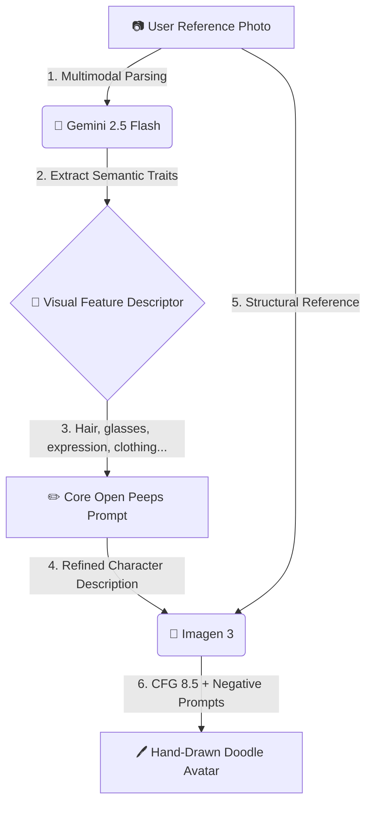

<p align="center">
  
</p>

<h1 align="center">🖊️ Peepify</h1>

<p align="center">
  <strong>Free AI Avatar Maker — Turn selfies into hand-drawn Open Peeps doodles</strong>
</p>

<p align="center">
  <a href="https://peppify.dhyani.site">🌐 Live Demo</a> •
  <a href="#-quick-start">🚀 Quick Start</a> •
  <a href="#-the-dual-model-pipeline">🧠 How It Works</a> •
  <a href="#-contributing">🤝 Contributing</a> •
  <a href="LICENSE">📄 License</a>
</p>

<p align="center">
  
  
  
  
  
</p>

---

## ✨ What Is Peepify?

Peepify is an **AI-powered avatar generator** that transforms your photos into beautiful **black & white hand-drawn doodle caricatures** in [Pablo Stanley's Open Peeps](https://www.openpeeps.com/) illustration style.

It uses a custom **dual-model pipeline** powered by **Google Gemini 2.5 Flash** for semantic facial analysis and **Imagen 3** for style-guided illustration generation — all running on **Vertex AI**.

<p align="center">
  <em>Upload a selfie → AI analyzes your features → Get a stunning hand-drawn avatar</em>
</p>

---

## 🎨 Design & Aesthetic

Peepify isn't just another AI tool — it's a **living, breathing sketch blueprint** designed entirely from scratch:

| Feature | Details |
|---------|---------|
| ✍️ **Marker Typography** | Google Fonts `Architects Daughter` (headers) + `Patrick Hand` (body) for a handcrafted felt-tip marker feel |
| 📐 **Sketchy Borders** | Irregular `border-radius` CSS tricks create hand-drawn, imperfect containers |
| ⚡ **Tactile Interactions** | Bold solid shadows that press-down on click, playful `sketch-wiggle` animations on hover |
| 🖤 **Chalkboard Dark Mode** | Light mode = warm sketch paper (`#fafaf6`). Dark mode = chalk outlines on charcoal blackboard (`#1e1e1e`) |
| 📱 **Fully Responsive** | Optimized for mobile, tablet, and desktop with smooth auto-scrolling during generation |

---

## 🧠 The Dual-Model Pipeline

Generating cartoon avatars from photos while preserving personal features is difficult. Peepify solves this with a **two-stage Vertex AI pipeline**:



### Stage 1: Semantic Analysis (`gemini-2.5-flash`)
The uploaded photo is analyzed by Gemini 2.5 Flash, which extracts precise facial traits — hair style/length, facial hair, glasses shape, clothing collar type, expression, and more — into a structured descriptor.

### Stage 2: Style-Guided Generation (`imagen-3.0-generate-002`)
The descriptor is dynamically combined with a Pablo Stanley core style prompt. With strict **negative prompts** and a high **guidance scale (CFG: 8.5)**, Imagen 3 generates a precise black & white Open Peeps caricature while preserving the person's key features.

---

## 🚀 Quick Start

### Prerequisites

- **Node.js** 18+ (20+ recommended)
- A **Google Cloud** account with:
  - Vertex AI API enabled
  - A Cloud Storage bucket for gallery images
  - Application Default Credentials (ADC) configured

### 1. Clone & Install

```bash
git clone https://github.com/dhyanivj/Peepify.git
cd Peepify
npm install
```

### 2. Configure Google Cloud Credentials

Peepify uses standard **Application Default Credentials (ADC)** for Vertex AI authentication:

```bash
# Login with your GCP account
gcloud auth application-default login
```

This stores credentials locally at `~/.config/gcloud/application_default_credentials.json`.

### 3. Set Environment Variables

```bash
cp .env.example .env.local
```

Edit `.env.local` with your values:

```env
# Path to your ADC credentials (local development only)
GOOGLE_APPLICATION_CREDENTIALS=/Users/YOUR_USERNAME/.config/gcloud/application_default_credentials.json

# Your GCP Project ID
GOOGLE_CLOUD_PROJECT=your-gcp-project-id

# Vertex AI region (us-east4 recommended for Imagen 3 availability)
GOOGLE_CLOUD_LOCATION=us-east4

# Admin dashboard passcode
ADMIN_PASSCODE=your-secure-passcode
```

### 4. Create a Cloud Storage Bucket

Peepify stores generated avatars in a GCS bucket named `{PROJECT_ID}-source-bucket`:

```bash
gsutil mb -l us-east4 gs://YOUR_PROJECT_ID-source-bucket
```

### 5. Run the Dev Server

```bash
npm run dev
```

Open **[http://localhost:3000](http://localhost:3000)** and start creating avatars! 🎉

---

## 🗂️ Project Structure

```
peepify/
├── app/
│   ├── api/
│   │   ├── auth/route.js           # Admin authentication endpoint
│   │   ├── gallery/
│   │   │   ├── route.js            # List public gallery avatars
│   │   │   ├── delete/route.js     # Admin: delete gallery items
│   │   │   ├── image/[id]/route.js # Serve avatar/reference images
│   │   │   └── save/route.js       # Save avatar to public gallery
│   │   ├── generate/route.js       # ⭐ Core AI generation pipeline
│   │   └── stats/route.js          # Admin analytics endpoint
│   ├── dashboard/
│   │   ├── layout.js               # Dashboard layout (noindex)
│   │   └── page.js                 # Admin dashboard UI
│   ├── favicon.ico
│   ├── globals.css                 # Complete design system
│   ├── layout.js                   # Root layout + SEO + JSON-LD schemas
│   ├── page.js                     # Main app UI
│   ├── robots.js                   # SEO robots configuration
│   └── sitemap.js                  # SEO sitemap configuration
├── public/                         # Static assets
├── .env.example                    # Environment variable template
├── Dockerfile                      # Production container config
├── next.config.mjs                 # Next.js config + security headers
└── package.json
```

---

## 🚀 Features

| Feature | Description |
|---------|-------------|
| 📷 **Camera Capture** | Snap directly from your webcam or phone camera using browser-native MediaStream API |
| 📁 **Drag & Drop Upload** | Drop a photo anywhere on the upload zone, or click to browse files |
| 🎨 **AI Avatar Generation** | Dual-model pipeline: Gemini 2.5 Flash + Imagen 3 for accurate, stylized results |
| 💾 **One-Click Download** | Save your generated doodle with a timestamped filename |
| 🖼️ **Public Gallery** | Opt-in to share your avatar in the community gallery with auto-generated funny names |
| 🌗 **Dark/Light Theme** | Seamless toggle between sketch paper and chalkboard themes |
| 📊 **Admin Dashboard** | Passcode-protected panel with analytics, daily trends, and image management |
| 🔒 **Security Hardened** | Input sanitization, brute-force protection delays, payload size limits |
| 🔍 **SEO Optimized** | Rich JSON-LD schemas, Open Graph, Twitter Cards, sitemap, robots.txt |
| 📱 **Fully Responsive** | Mobile-first design with smooth auto-scroll during avatar generation |

---

## ☁️ Deployment

### Google Cloud Run (Recommended)

Cloud Run automatically provides credentials via the default compute Service Account — **no JSON keys needed** in production.

```bash
# Deploy directly from source
gcloud run deploy peepify \
  --source . \
  --region us-east4 \
  --set-env-vars "GOOGLE_CLOUD_PROJECT=your-project-id,GOOGLE_CLOUD_LOCATION=us-east4,ADMIN_PASSCODE=your-passcode"
```

Or use the built-in deploy script:

```bash
npm run deploy
```

### Docker

```bash
# Build the image
docker build -t peepify .

# Run the container
docker run -p 3000:3000 \
  -e GOOGLE_CLOUD_PROJECT=your-project-id \
  -e GOOGLE_CLOUD_LOCATION=us-east4 \
  -e ADMIN_PASSCODE=your-passcode \
  peepify
```

### Vercel

1. Set environment variables in the Vercel Dashboard:
   - `GOOGLE_CLOUD_PROJECT`
   - `GOOGLE_CLOUD_LOCATION`
   - `GOOGLE_APPLICATION_CREDENTIALS_JSON` (raw JSON content of your Service Account Key)
   - `ADMIN_PASSCODE`
2. You'll need to modify the SDK initialization to parse the credentials JSON from environment.

---

## 🛠️ Tech Stack

| Technology | Purpose |
|-----------|---------|
| [Next.js 16](https://nextjs.org/) | Full-stack React framework |
| [React 19](https://react.dev/) | UI library |
| [Gemini 2.5 Flash](https://ai.google.dev/) | Multimodal image analysis |
| [Imagen 3](https://cloud.google.com/vertex-ai/generative-ai/docs/image/generate-images) | AI image generation |
| [Google Cloud Storage](https://cloud.google.com/storage) | Avatar and reference image storage |
| [Google Cloud Run](https://cloud.google.com/run) | Serverless container deployment |
| Vanilla CSS | Hand-crafted design system (no Tailwind) |

---

## 🤝 Contributing

Contributions are welcome! Please read our [Contributing Guide](CONTRIBUTING.md) for details on our code of conduct, development workflow, and how to submit pull requests.

---

## 📄 License

This project is licensed under the **MIT License** — see the [LICENSE](LICENSE) file for details.

---

## 🙏 Acknowledgments

- **[Pablo Stanley](https://twitter.com/paborstudio)** for the incredible [Open Peeps](https://www.openpeeps.com/) illustration library that inspired this project's art style
- **[Google DeepMind](https://deepmind.google/)** for Gemini 2.5 Flash and Imagen 3 models
- **[Google Cloud](https://cloud.google.com/)** for Vertex AI, Cloud Run, and Cloud Storage infrastructure

---

<p align="center">
  Made with ✏️ and ❤️ by <a href="https://dhyani.site">Vijay Dhyani</a>
</p>
