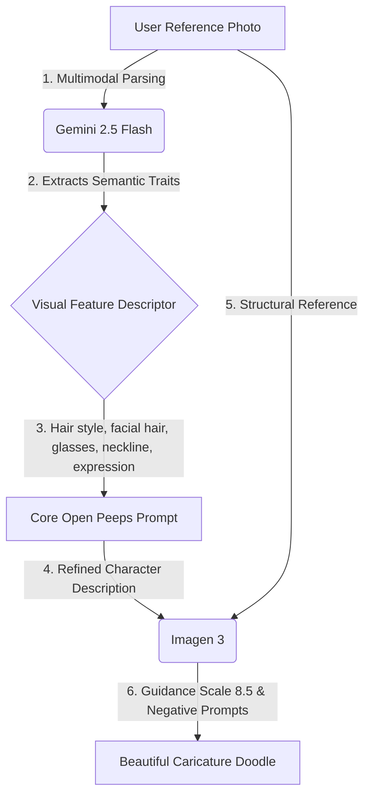

# 🖊️ Peepify

> **Handcrafted by Vijay Dhyani**  
> *A quirky, whimsical hand-drawn avatar generator that turns your photos into caricature doodles in Pablo Stanley's signature Open Peeps illustration style!*

---

## 🎨 The Design & Aesthetic
Peepify is designed completely from scratch as a **living, breathing sketch blueprint**:
* ✍️ **Marker Typography:** Uses Google Fonts `Architects Daughter` (logos and headlines) and `Patrick Hand` (body copy & buttons) to give a handcrafted felt-tip marker style.
* 📐 **Sketchy Uneven Borders:** Pure CSS irregular `border-radius` shaping tricks create sketchy, imperfect containers and inputs, looking like shaky hand-drawn lines on physical paper.
* ⚡ **Tactile Interactive wiggles:** Features flat, bold solid shadows (`box-shadow: 4px 4px 0px #000`) that physically press down on click (`transform: translate(3px, 3px)`). Interactive elements playfully tilt and wiggle on hover using custom `@keyframes sketch-wiggle` animations.
* 🖤 **Chalkboard Dark Mode:** In light mode, enjoy drawing on warm sketch paper (`#fafaf6`). Toggling the dark mode turns the app into glowing white chalk outlines on a charcoal-black chalkboard (`#1e1e1e`).

---

## 🧠 Under The Hood: The Dual-Model Pipeline
Generating cartoon avatars from photographs while keeping key personal identifiers is difficult. Peepify solves this by executing a custom **two-stage Google Gen AI (Vertex AI) pipeline**:



1. **Stage 1: Multimodal Semantic Analysis (`gemini-2.5-flash`)**
   The browser-native camera or uploaded file is routed to `gemini-2.5-flash`. Gemini acts as the "eye," extracting exact features such as hair style/length, facial hair, glasses shape, clothing collar type, and mood expression, returning a comma-separated descriptor list.
2. **Stage 2: Style-Guided Generation (`imagen-3.0-generate-002`)**
   The descriptor list is dynamically prepended to the Pablo Stanley core style prompt. Together with strict negative prompts and a high **Guidance Scale (CFG: 8.5)**, Imagen 3 translates the structural details of the photo into the precise black & white abstract caricature.

---

## 🚀 Features & Controls
* 📷 **Device Camera Integration:** Snapshot directly from your phone or webcam using the native browser camera stream (mirrored for natural alignment) and a canvas-based grabber.
* 📁 **Drag-and-Drop Uploader:** Fully functional drag-and-drop or file upload area.
* 💾 **One-Click Download:** Instantly save your generated doodle with a custom filename timestamp.
* 🌗 **Chalkboard Toggle:** Toggle seamlessly between textured sketching paper and slate blackboard themes.

---

## 🛠️ Quick Start

### 1. Clone & Install Dependencies
```bash
git clone <your-repository-url>
cd ai-app
npm install
```

### 2. Configure Google Cloud ADC Credentials
Peepify uses standard Google Cloud Application Default Credentials (ADC) to authenticate with Vertex AI. Make sure you have authorized access on your local development machine:
```bash
# Ensure you are logged in to GCP with application credentials
gcloud auth application-default login
```
This stores your ADC credentials locally (usually at `~/.config/gcloud/application_default_credentials.json`).

### 3. Setup Your Environment Variables
Copy the template `.env.example` file to `.env.local` (Git is configured to ignore this secure file automatically):
```bash
cp .env.example .env.local
```
Open `.env.local` and configure your GCP variables:
```env
GOOGLE_APPLICATION_CREDENTIALS=/Users/YOUR_USERNAME/.config/gcloud/application_default_credentials.json
GOOGLE_CLOUD_PROJECT=your-gcp-project-id
GOOGLE_CLOUD_LOCATION=us-east4
```

### 4. Run Development Server
```bash
npm run dev
```
Open **[http://localhost:3000](http://localhost:3000)** in your browser and start doodling!

---

## ☁️ Deployment Guidelines

When deploying Peepify to production (Vercel, Google Cloud Run, etc.):

### Authentication on Vercel
1. Set the following environment variables in your Vercel Dashboard:
   - `GOOGLE_CLOUD_PROJECT`: Your Google Cloud Project ID.
   - `GOOGLE_CLOUD_LOCATION`: Your Vertex AI Location region (e.g. `us-east4`).
   - `GOOGLE_APPLICATION_CREDENTIALS_JSON`: The raw content of your Service Account Key JSON file.
2. Update `/app/api/generate/route.js` (or your startup configuration) to write the content of `GOOGLE_APPLICATION_CREDENTIALS_JSON` into a temporary credentials file, or initialize the SDK directly using client credentials if supported.

### Authentication on Google Cloud Run (Recommended)
Since Peepify is built on Next.js, it can be containerized and deployed to **Google Cloud Run** in a few clicks:
1. Cloud Run automatically binds the default compute Service Account credentials to your container. You **do not need** to export JSON keys or set `GOOGLE_APPLICATION_CREDENTIALS` in production!
2. Simply deploy the container and set `GOOGLE_CLOUD_PROJECT` and `GOOGLE_CLOUD_LOCATION` as environment variables.
